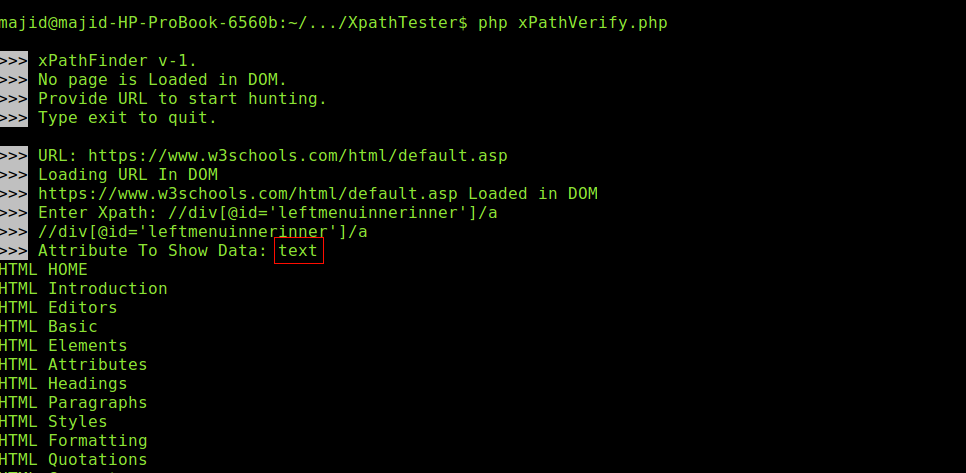
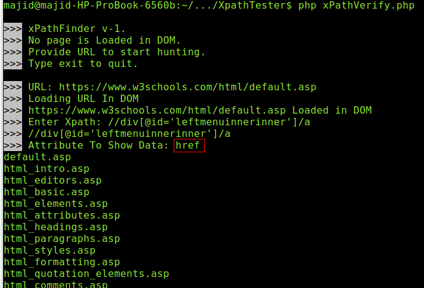

# XPath Validation Script

The XPath Validation Script is a useful tool designed to simplify the process of finding the exact XPath expressions for data points when working on data scraping or website test automation using Selenium. This script saves you time and effort by loading your target web page and allowing you to test XPath expressions directly.

## Prerequisites

Before using this script, ensure that you have the following:

- PHP installed on your system.
- Access to a web server or a local development environment.

## Usage

Follow the steps below to use the XPath verification script:

1. Clone or download the repository to your local machine or web server.
2. Ensure that the `xPathVerify.php` script is placed in a directory accessible by your web server or PHP interpreter.
3. Go to that directory and run `php xPathVerify.php`
4. Give required input.
5. Give `text` as attribute when you need to see nodevalue of selected element, any other input ie. `href`, `src` will be processed as attributes of element .

## Get Node Value

## Get Attribute 'href' 

Feel free to modify the script to suit your specific requirements and enhance its functionality.

## Contributing

If you have any improvements or suggestions for this script, please feel free to contribute by submitting a pull request. Your contributions are highly appreciated!

## License

This project is licensed under the [MIT License](LICENSE). You are free to use, modify, and distribute this script as per the terms of the license.

---

Happy verifying! If you have any questions or need further assistance, please don't hesitate to reach out.

*[Muhammad Majid]*